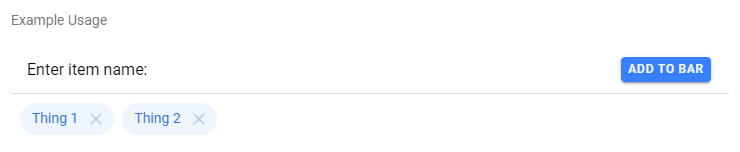

# anion-chip-bar

Chip Bar is a visual collection of `ion-chip` components with a button that allows individual chips to be removed from the bar.

[Click this link to go to CodePen example](https://codepen.io/gopherrdiggs/pen/JVNBwX)

<!-- Auto Generated Below -->

## Properties

| Property       | Attribute       | Description                                | Type     | Default     |
| -------------- | --------------- | ------------------------------------------ | -------- | ----------- |
| `defaultChips` | `default-chips` | Default set of chips to appear in the bar. | `string` | `undefined` |

## Events

| Event              | Description                     | Type                |
| ------------------ | ------------------------------- | ------------------- |
| `anionChipRemoved` | Emitted when a chip is removed. | `CustomEvent<void>` |

## Methods

### `addChip(chipText: string) => Promise<void>`

Add a chip to the bar.

#### Parameters

| Name       | Type     | Description                            |
| ---------- | -------- | -------------------------------------- |
| `chipText` | `string` | The text that will appear in the chip. |

#### Returns

Type: `Promise<void>`

### `clearChips() => Promise<void>`

Remove all chips from the bar.

#### Returns

Type: `Promise<void>`

### `getChips() => Promise<string[]>`

Get the chips currently in the bar.

#### Returns

Type: `Promise<string[]>`

### `removeChip(chipText: string) => Promise<void>`

Remove a chip from the bar.

#### Parameters

| Name       | Type     | Description                     |
| ---------- | -------- | ------------------------------- |
| `chipText` | `string` | The text of the chip to remove. |

#### Returns

Type: `Promise<void>`

### `setChips(chipTexts: string[]) => Promise<void>`

Set the chips in the bar.
Note: any existing chips are cleared first.

#### Parameters

| Name        | Type       | Description                            |
| ----------- | ---------- | -------------------------------------- |
| `chipTexts` | `string[]` | String array of text values for chips. |

#### Returns

Type: `Promise<void>`

----------------------------------------------

*Built with [StencilJS](https://stenciljs.com/)*
