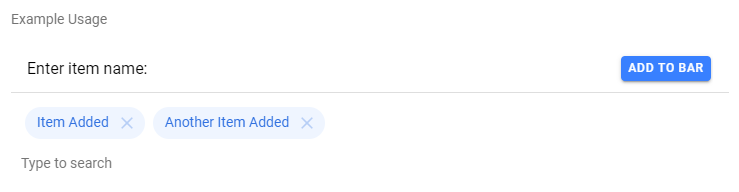

# anion-chip-searchbar

Chip Searchbar is a combination of a `anion-chip-bar` component with an input field that can be used as a search field.

[Click this link to go to CodePen example](https://codepen.io/gopherrdiggs/pen/wZdOOX)

<!-- Auto Generated Below -->

## Properties

| Property           | Attribute           | Description                                               | Type     | Default            |
| ------------------ | ------------------- | --------------------------------------------------------- | -------- | ------------------ |
| `chipColor`        | `chip-color`        | The name of the color applied to chips - e.g., 'primary'. | `string` | `'primary'`        |
| `inputPlaceholder` | `input-placeholder` | The placeholder text of the input element.                | `string` | `'Type to search'` |
| `labelText`        | `label-text`        | The text of the associated searchbar label.               | `string` | `undefined`        |

## Events

| Event              | Description                                             | Type                |
| ------------------ | ------------------------------------------------------- | ------------------- |
| `anionInputChange` | Emitted when the value of the input element is changed. | `CustomEvent<void>` |

## Methods

### `addChip(chipText: string) => Promise<void>`

Add a chip to the bar.

#### Parameters

| Name       | Type     | Description                            |
| ---------- | -------- | -------------------------------------- |
| `chipText` | `string` | The text that will appear in the chip. |

#### Returns

Type: `Promise<void>`

### `clearChips() => Promise<void>`

Remove all chips from the bar.

#### Returns

Type: `Promise<void>`

### `clearText() => Promise<void>`

Clear the text of the input element.

#### Returns

Type: `Promise<void>`

### `getChips() => Promise<string[]>`

Get the chips current in the bar.

#### Returns

Type: `Promise<string[]>`

### `removeChip(chipText: string) => Promise<void>`

Remove a chip from the bar.

#### Parameters

| Name       | Type     | Description                     |
| ---------- | -------- | ------------------------------- |
| `chipText` | `string` | The text of the chip to remove. |

#### Returns

Type: `Promise<void>`

### `setChips(chipTexts: string[]) => Promise<void>`

Set the chips in the bar.
Note: any existing chips are cleared first.

#### Parameters

| Name        | Type       | Description                            |
| ----------- | ---------- | -------------------------------------- |
| `chipTexts` | `string[]` | String array of text values for chips. |

#### Returns

Type: `Promise<void>`

### `setFocus() => Promise<void>`

Set focus on the input element.

#### Returns

Type: `Promise<void>`

----------------------------------------------

*Built with [StencilJS](https://stenciljs.com/)*
